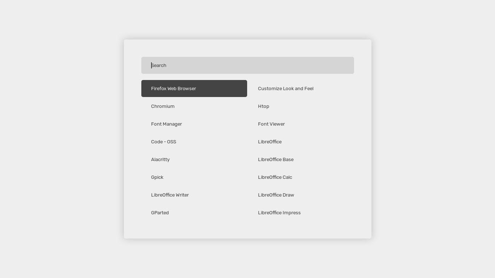

# rofi.

rofi themes collection (rebooted)

</img>

## installation
clone the repository and run the installation script (might not work).

## modification
open up `config.rasi` in a text editor of your choice. 
it should contain one line: `@theme "themes/default"`, that means rofi is using the default theme.
if you want to make modifications to it then copy the configuration of the element of your choice from the respective theme file to `config.rasi` and tweak the values to your likings.

## preview
not today

## note
requirements:

    - fonts: rubik, feather
    - your profile picture for pfp theme
    - something else I might have forgotten

## contributing

    - send fixes if you find broken stuff
    - open issues if you find missing stuff
    - open PRs for your own themes, if they're kewl enough
